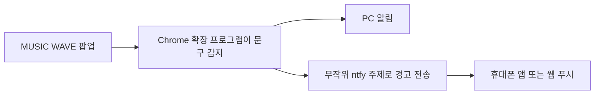

# Music Wave Alert

멜론 MUSIC WAVE 페이지의 확인·감지 팝업을 찾아 PC와 휴대폰으로 알려주는 Chrome 확장 프로그램입니다.

> 이 프로젝트는 개인 편의를 위한 비공식 도구이며 멜론, 카카오엔터테인먼트, ntfy와 제휴하거나 공식 지원을 받지 않습니다.

## 다운로드

**[Music Wave Alert v1.1.1 다운로드](./release/music-wave-alert-extension-v1.1.1.zip?download=1)**

ZIP 파일을 받은 뒤 압축을 풀고, 아래 설치 방법에 따라 Chrome에 불러오세요.

## 주요 기능

| 기능 | 동작 |
| --- | --- |
| 계속 듣기 감지 | PC 알림, 페이지 알림, 경고음, 탭 제목 깜빡임, 선택형 휴대폰 알림 |
| 기계적 스트리밍 감지 | 중요도가 높은 PC·휴대폰 알림과 MUSIC WAVE 탭 열기 |
| 사용자 새로고침 | 계속 듣기 PC 알림에서 **이 탭 새로고침** 버튼 제공 |
| 휴대폰 연결 | ntfy 앱 또는 ntfy 웹 푸시 중 선택 |
| 사용자별 채널 | 충분히 긴 무작위 ntfy 주제를 사용자마다 별도로 생성 |

확장 프로그램은 경고를 자동으로 닫거나 인증 절차를 우회하지 않습니다. 기계적 스트리밍 감지가 발생하면 사용자가 직접 탭을 열어 확인해야 합니다.

## 감지하는 문구

현재 다음 실제 팝업 문구와 `#alertButton.melon-modal.d_modal_confirm` 구조를 기준으로 테스트합니다.

- `지금 듣고계신 음악을 계속 들으시겠습니까?`
- `기계적인 스트리밍 패턴이 감지되어 인증을 진행합니다.`

MUSIC WAVE의 문구나 화면 구조가 변경되면 감지가 동작하지 않을 수 있습니다.

## 설치

현재 버전은 Chrome 웹 스토어에 등록되지 않았으므로 개발자 모드로 설치합니다.

1. 최신 ZIP 파일의 압축을 풉니다.
2. Chrome 주소창에서 `chrome://extensions`를 엽니다.
3. 오른쪽 위의 **개발자 모드**를 켭니다.
4. **압축해제된 확장 프로그램을 로드합니다**를 누릅니다.
5. `manifest.json`이 들어 있는 `music-wave-alert-extension` 폴더를 선택합니다.
6. 이미 열려 있던 MUSIC WAVE 페이지를 새로고침합니다.

설치 후 Chrome 확장 메뉴에서 Music Wave Alert를 툴바에 고정하면 편리합니다.

## 기본 사용 방법

1. MUSIC WAVE 페이지를 열어둡니다.
2. Music Wave Alert 아이콘을 누릅니다.
3. **PC 테스트 알림 보내기**로 Chrome과 운영체제 알림 상태를 확인합니다.
4. 필요에 따라 데스크톱 알림, 페이지 경고음, 탭 제목 깜빡임을 켜거나 끕니다.
5. 경고가 감지되면 알림을 눌러 해당 MUSIC WAVE 탭을 확인합니다.

감지를 위해 Chrome과 MUSIC WAVE 탭이 열려 있어야 합니다. Codex와 휴대폰 연결 페이지는 계속 실행할 필요가 없습니다.

## 휴대폰 알림 연결

연결 안내 페이지: <https://music-wave-alert-connect.ho1.chatgpt.site>

1. 확장 프로그램에서 **휴대폰 알림**을 켭니다.
2. **휴대폰 연결 만들기**를 누릅니다.
3. PC에 표시된 QR을 휴대폰 카메라로 스캔합니다.
4. 휴대폰에서 **ntfy 앱으로 받기** 또는 **앱 없이 웹으로 받기**를 선택합니다.
5. 웹 방식을 선택했다면 ntfy에서 구독하고 브라우저 알림과 백그라운드 알림을 허용합니다.
6. PC 확장 프로그램으로 돌아와 **휴대폰 테스트**를 누릅니다.

Android에서는 ntfy 웹 앱을 홈 화면에 설치하면 백그라운드 알림이 안정적입니다. iPhone 웹 알림은 iOS 16.4 이상에서 Safari의 **홈 화면에 추가**를 사용해야 합니다. 안정성을 우선하면 ntfy 앱 방식을 권장합니다.

## 동작 원리



휴대폰 연결 페이지는 무작위 알림 주제를 휴대폰에 등록하는 역할만 합니다. 연결이 끝난 뒤에는 데이터 전달 경로에 포함되지 않습니다.

## 선택 팁: 탭별 볼륨

[Volume Master](https://chromewebstore.google.com/detail/volume-master/jghecgabfgfdldnmbfkhmffcabddioke)를 사용하면 Chrome 탭마다 볼륨을 0%부터 600%까지 조절할 수 있습니다.

MUSIC WAVE 탭을 음소거하면 이 확장 프로그램의 페이지 경고음도 들리지 않을 수 있으므로 PC 알림 또는 휴대폰 알림을 함께 켜두세요.

## 개인정보와 권한

| 권한·접근 범위 | 사용 목적 |
| --- | --- |
| `https://musicwave.melon.com/*` | 경고 팝업 문구 감지 |
| `notifications` | PC 알림 표시 |
| `storage` | 설정과 마지막 감지 정보 저장 |
| `activeTab` | 현재 탭을 대상으로 테스트·알림 동작 수행 |
| 선택 권한 `https://ntfy.sh/*` | 사용자가 휴대폰 알림을 켰을 때만 ntfy로 경고 전송 |

- 채팅 내용과 멜론 계정 정보는 수집하거나 전송하지 않습니다.
- 휴대폰 알림이 꺼져 있으면 경고 정보가 외부 알림 서비스로 전송되지 않습니다.
- 휴대폰 알림을 켜면 일반화된 경고 제목과 메시지만 `ntfy.sh`로 전송합니다. MUSIC WAVE 페이지 주소와 채팅 내용은 보내지 않습니다.
- 감지된 경고 종류와 마지막 감지 시각은 Chrome 확장 프로그램 저장소에 보관합니다.
- ntfy 주제는 긴 무작위 문자열이지만 해당 연결 주소를 아는 사람은 알림을 구독할 수 있으므로 `?topic=...` 주소를 공개하지 마세요.

## 제한사항

- Chrome과 MUSIC WAVE 탭이 종료되면 경고를 감지할 수 없습니다.
- Chrome·Windows·휴대폰의 알림 권한이 꺼져 있으면 시스템 알림이 표시되지 않습니다.
- 웹 푸시 동작은 모바일 운영체제와 브라우저 정책의 영향을 받습니다.
- 사이트의 확인 버튼을 자동으로 누르거나 CAPTCHA·인증을 우회하지 않습니다.
- 계속 듣기 알림의 새로고침은 사용자가 PC 알림에서 직접 선택할 때만 실행됩니다.

## 개발 및 테스트

Manifest V3 기반의 별도 빌드 과정이 없는 JavaScript 확장 프로그램입니다. Node.js 20 이상에서 다음 테스트를 실행할 수 있습니다.

```powershell
node --test .\tests\detector-core.test.js .\tests\notification-providers.test.js .\tests\extension-wiring.test.js
```

JavaScript 문법 검사는 다음과 같이 실행합니다.

```powershell
Get-ChildItem -Filter *.js | ForEach-Object { node --check $_.FullName }
```

## 버전

### 1.1.1

- 실제 `#alertButton.melon-modal.d_modal_confirm` 팝업 우선 감지
- 휴대폰 알림 전송 실패 시 제한된 자동 재시도
- 확장 팝업에서 현재 감지 중인 경고 종류 표시

### 1.1.0

- ntfy 앱·웹 푸시를 이용한 선택형 휴대폰 알림
- 사용자별 무작위 알림 주제와 QR 연결 페이지
- PC 알림과 휴대폰 알림을 독립적으로 설정
- 휴대폰 테스트 알림 및 개인정보 안내 추가

## 관련 프로젝트

- 휴대폰 연결 사이트: <https://music-wave-alert-connect.ho1.chatgpt.site>
